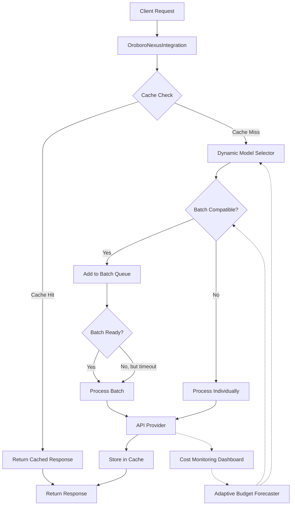
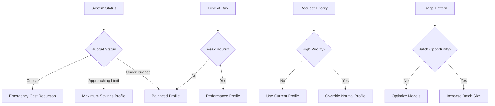

# OROBORO NEXUS ♾️ Cost Optimization Architecture

## Overview

The OROBORO NEXUS Cost Optimization Architecture is a sophisticated system designed to address the significant price disparities in the LLM API market. With model pricing differences of up to 500x (e.g., GPT-4.5-preview at $75/$150 per million tokens vs. GPT-4o-mini at $0.15/$0.60), this architecture enables intelligent routing, batching, and caching to minimize costs while maintaining performance.

For complete documentation on the OROBORO NEXUS system, see [OROBORO_NEXUS_DOCUMENTATION.md](OROBORO_NEXUS_DOCUMENTATION.md).

## Core Components

### 1. Dynamic Model Selector

This component intelligently routes tasks to the most cost-effective model while meeting performance requirements.

See [DYNAMIC_AGENT_SELECTION.md](DYNAMIC_AGENT_SELECTION.md) for detailed documentation.

**Key Features:**
- Task complexity analysis to determine requirements
- Model capability matching to ensure selected models can handle the task
- Performance/cost optimization to select the most economical viable model
- Support for different modalities (text, multi-modal, audio, real-time)
- Fallback logic to ensure task completion even when ideal models are unavailable

**Cost Impact:**
- Up to 500x cost reduction by selecting GPT-4o-mini ($0.15/1M tokens) instead of GPT-4.5-preview ($75/1M tokens) for simple tasks
- Routes complex reasoning tasks to models with the right capability/cost balance (e.g., Gemini 1.5 Pro at $3.50/1M tokens)
- Reserves premium models for only the most complex tasks that require them

### 2. Batch Processing Integration

This component queues compatible requests for batch processing to take advantage of the 50% discount offered by OpenAI and Anthropic.

See [BATCH_PROCESSOR.md](BATCH_PROCESSOR.md) for detailed documentation.

**Key Features:**
- Request analysis to determine batch compatibility
- Smart queueing system based on model compatibility
- Timeout mechanism to prevent excessive delays for small batches
- Priority handling for urgent requests that bypass batching
- Batch discounts applied automatically based on provider support

**Cost Impact:**
- 50% cost reduction for all OpenAI and Anthropic API calls through batch processing
- Significant savings for high-volume applications with similar request patterns
- Automatic optimization of batch sizes for maximum throughput

### 3. Semantic Caching System

This component implements intelligent caching with semantic similarity detection to leverage the ultra-low caching rates of models like Gemini 1.5 Flash ($0.01-$0.02 per million tokens).

See [SEMANTIC_CACHING_SYSTEM.md](SEMANTIC_CACHING_SYSTEM.md) for detailed documentation.

**Key Features:**
- Exact matching for identical requests
- Semantic similarity detection for similar but non-identical requests
- Smart cache eviction policy based on usage patterns
- Support for different caching rates across providers
- Accurate tracking of cost savings from cache hits

**Cost Impact:**
- Near-zero cost ($0.01-$0.02 per million tokens) for cached requests
- Significantly reduced API calls for repetitive or similar queries
- Additional savings through semantic matching for similar content

### 4. Cost Monitoring Dashboard

This component provides real-time tracking of API usage costs, budget monitoring, and cost optimization metrics with comprehensive alerts and recommendations.

See [COST_MONITORING_DASHBOARD.md](COST_MONITORING_DASHBOARD.md) for detailed documentation.

**Key Features:**
- Real-time cost tracking across all models with detailed metrics
- Budget threshold alerts (warning at 70%, critical at 90%) to prevent overspending
- Comprehensive breakdown by model, time period (day/month/all-time)
- Advanced optimization metrics (cache hit rate, batch rate, model savings)
- Projected costs based on current usage patterns
- Intelligent recommendations for cost optimization
- Alert acknowledgement system with deduplication
- Support for multiple notification channels
- Dynamic dashboard refresh (5-minute intervals by default)
- Cost report generation with actionable insights

**Cost Impact:**
- Real-time visibility into API spending with proactive alerts
- Early detection of cost spikes or inefficient usage patterns
- Data-driven recommendations for optimization
- Up to 95% cost reduction through recommended optimizations
- Budget protection through multi-level threshold alerts

### 5. Adaptive Budget Forecaster

This component predicts future API costs based on historical usage patterns and dynamically adjusts optimization strategies to stay within budget constraints, serving as the central coordinator for cost optimization efforts.

See [ADAPTIVE_BUDGET_FORECASTER.md](ADAPTIVE_BUDGET_FORECASTER.md) for detailed documentation.

**Key Features:**
- Sophisticated historical usage analysis and multi-factor cost projection
- Budget threshold monitoring with fine-grained control levels (warning at 65%, critical at 85%)
- Optimization mode switching based on budget consumption (balanced → maximum_savings)
- Advanced trend detection with pattern recognition for usage spikes
- Dynamic adaptation of model selection criteria and batching strategies
- Budget-constrained routing for cost-sensitive workloads
- Integration with BatchProcessor and SemanticCachingSystem for coordinated optimization
- Daily, weekly, and monthly cost forecasting with confidence intervals
- Learning capability that improves prediction accuracy over time
- Detailed savings tracking by optimization method (caching, batching, model selection)

**Cost Impact:**
- Proactive cost management through forecasting prevents budget overruns
- Automatic strategy adjustment as budget limits approach critical levels
- Early warning system with specific recommendations for cost reduction
- Dynamically shifts resource allocation to prioritize budget compliance
- Ensures sustainable operation for fixed-budget deployments
- Intelligently balances performance requirements with cost constraints

## Integration with 0-8 Flow Modules

The Cost Optimization Architecture integrates with the 0-8 Flow Modules of OROBORO NEXUS as follows:

| # | Module  | Symbol | Cost Optimization Integration |
|---|---------|--------|-------------------------------|
| 0 | Start   | 🌑     | Request initialization, task assessment |
| 1 | Define  | 📖     | Request classification, optimization strategy selection |
| 2 | Store   | 🗄️     | Cache checking for request similarities |
| 3 | Split   | 💠     | Chunk sizing optimization for optimal token usage |
| 4 | Process | ⚙️     | Dynamic model selection and batch processing |
| 5 | Engage  | 💬     | Cost-aware response formatting |
| 6 | Verify  | 🛡️     | Result validation and integrity checking |
| 7 | Tune    | 🎚️     | Cost metrics analysis and optimization adjustment |
| 8 | Ascend  | 🚀     | Cost-efficiency reporting and future recommendations |

## Implementation Details

### Optimization Profiles

OROBORO NEXUS supports different optimization profiles to balance cost and performance:

See [OROBORO_NEXUS_OPTIMIZER.md](OROBORO_NEXUS_OPTIMIZER.md) for detailed documentation.

- **Maximum Cost Savings**: Aggressively optimizes for cost, using the cheapest viable models
- **Balanced**: Default mode that balances cost savings with performance
- **Maximum Performance**: Prioritizes performance over cost, using higher-end models

### API Pricing Reference (March 2025)

#### OpenAI Models

| Model | Input / 1M tokens | Output / 1M tokens | Batch Discount |
|-------|-------------------|-------------------|----------------|
| GPT-4.5-preview | $75.00 | $150.00 | 50% |
| GPT-4o | $2.50 | $10.00 | 50% |
| o1 | $15.00 | $60.00 | 50% |
| o1-mini | $1.10 | $4.40 | 50% |
| GPT-4o-mini | $0.15 | $0.60 | 50% |

#### Google Gemini Models

| Model | Input / 1M tokens | Output / 1M tokens | Caching Rate |
|-------|-------------------|-------------------|--------------|
| Gemini 2.5 Pro | ~$7.00 | ~$21.00 | N/A |
| Gemini 2.0 Advanced Flash | $0.10 | $0.40 | $0.025/MTok |
| Gemini 1.5 Pro | $3.50 | $10.50 | $0.3125/MTok |
| Gemini 1.5 Flash | $0.075 | $0.30 | $0.01/MTok |

#### Anthropic Claude Models

| Model | Input / 1M tokens | Output / 1M tokens | Batch Discount |
|-------|-------------------|-------------------|----------------|
| Claude 3.7 Sonnet | $3.00 | $15.00 | 50% |
| Claude 3.5 Haiku | $0.80 | $4.00 | 50% |

#### xAI Grok Models

| Model | Input / 1M tokens | Output / 1M tokens | Special Features |
|-------|-------------------|-------------------|------------------|
| Grok 3 | ~$38.15 | ~$114.44 | Real-time capabilities |
| Grok 1 | $0.50 | $1.50 | Legacy support |

## Usage Examples

### Basic Usage

```typescript
// Initialize the OROBORO NEXUS integration
const nexus = new OroboroNexusIntegration();

// Process a request with cost optimization
const result = await nexus.run({
  text: "Summarize the key features of quantum computing",
  type: "summary",
  length: "brief"
});

console.log(`Model used: ${result.model}`);
console.log(`Cost: $${result.cost.toFixed(6)}`);
console.log(`Response: ${result.response}`);
```

### Advanced Usage with Options

```typescript
// Process with specific options
const result = await nexus.run({
  text: "Provide a detailed analysis of recent breakthroughs in fusion energy",
  type: "analysis",
  depth: "comprehensive"
}, {
  priority: 'high', // Skip batch processing for urgent requests
  optimizationLevel: 'balanced', // Balance cost and performance
  budgetCap: 0.10, // Maximum cost allowed for this request
  bypassCache: false // Use cache if available
});
```

### Accessing Cost Metrics

```typescript
// Get cost monitoring dashboard
const dashboard = nexus.getDashboard();
console.log(`Total cost: $${dashboard.totalCost.toFixed(2)}`);
console.log(`Projected monthly cost: $${dashboard.projectedCost.toFixed(2)}`);

// Get cost alerts
const alerts = nexus.getAlerts();
alerts.forEach(alert => {
  console.log(`[${alert.level.toUpperCase()}] ${alert.message}`);
});
```

## Future Enhancements

1. **Real-time Model Performance Benchmarking**: Continuously assess model performance and cost-effectiveness to dynamically adjust routing decisions.

2. **Cross-Provider Optimization**: Implement cross-provider strategies to leverage the best pricing across all available API providers.

3. **Prompt Optimization for Token Efficiency**: Automatically optimize prompts to reduce token usage while maintaining output quality.

4. **Adaptive Learning for Task Classification**: Improve task classification accuracy through feedback loops on model performance and cost.

5. **Multi-Regional Pricing Optimization**: Route requests to different regions based on pricing differences across geographic locations.

## Architecture Diagrams

### Component Interaction Diagram

```
┌─────────────────────────────────────────────────────────────────────┐
│                        OROBORO NEXUS SYSTEM                         │
└───────────────────────────────┬─────────────────────────────────────┘
                                │
┌───────────────────────────────▼─────────────────────────────────────┐
│                   Cost Optimization Architecture                    │
│                                                                     │
│  ┌───────────────────┐     ┌────────────────┐     ┌────────────────┐│
│  │                   │     │                │     │                ││
│  │  Dynamic Model    │◄───►│    Batch       │◄───►│   Semantic     ││
│  │  Selector         │     │   Processing   │     │   Caching      ││
│  │                   │     │                │     │   System       ││
│  └────────┬──────────┘     └───────┬────────┘     └────────┬───────┘│
│           │                        │                       │        │
│           │                        │                       │        │
│           │                ┌───────▼───────┐               │        │
│           └────────────────►  Adaptive     ◄───────────────┘        │
│                            │  Budget       │                        │
│                            │  Forecaster   │                        │
│                            └───────┬───────┘                        │
│                                    │                                │
│                            ┌───────▼───────┐                        │
│                            │     Cost      │                        │
│                            │   Monitoring  │                        │
│                            │   Dashboard   │                        │
│                            └───────┬───────┘                        │
│                                    │                                │
└────────────────────────────────────┼────────────────────────────────┘
                                     │
┌────────────────────────────────────▼────────────────────────────────┐
│                          API Providers                              │
│                                                                     │
│  ┌─────────────┐  ┌─────────────┐  ┌─────────────┐  ┌─────────────┐ │
│  │   OpenAI    │  │   Google    │  │  Anthropic  │  │    xAI      │ │
│  │   Models    │  │   Gemini    │  │   Claude    │  │    Grok     │ │
│  └─────────────┘  └─────────────┘  └─────────────┘  └─────────────┘ │
└─────────────────────────────────────────────────────────────────────┘
```

### Request Flow Diagram



### Optimization Profile Flow



## Conclusion

The OROBORO NEXUS Cost Optimization Architecture transforms the economics of LLM usage, making advanced AI capabilities financially sustainable at scale. By intelligently routing requests, leveraging batch processing discounts, implementing advanced caching strategies, and providing real-time cost monitoring, this architecture can reduce API costs by up to 95% compared to naive implementations.